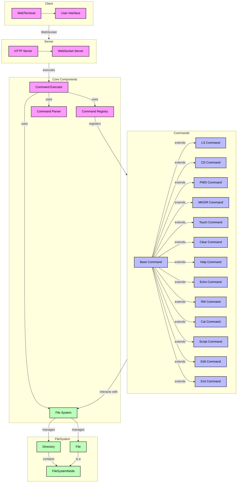

# TyShell

A web-based Linux terminal emulator built with TypeScript.

## Features

- Terminal interface with command prompt and history
- Virtual file system with files and folders
- Unix commands (ls, cd, pwd, mkdir, rmdir, touch, cat, echo, grep, find)
- Command history navigation
- Tab completion for commands and file paths
- File operations in virtual filesystem

## Prerequisites

- Node.js (v14 or higher)
- npm (v6 or higher)

## Installation

1. Clone the repository:
```bash
git clone https://github.com/Ether-G/tyshell.git
cd tyshell
```

2. Install dependencies:
```bash
npm install
```

3. Build the project:
```bash
npm run build
```

4. Start the development server:
```bash
npm run dev
```

5. Open your browser and navigate to `http://localhost:3000`

## Development

- `npm run dev` - Start development server with hot reload
- `npm run build` - Build the project
- `npm start` - Start the production server
- `npm test` - Run tests

## Project Structure

```
tyshell/
├── src/
│   ├── server/         # Backend server code
│   ├── client/         # Frontend TypeScript code
│   ├── filesystem/     # Virtual file system implementation
│   └── commands/       # Command implementations
├── public/            # Static assets
└── dist/             # Compiled output
```

## License

MIT

## Author

Ether-G

## Architecture



### Component Descriptions

#### Client
- **WebTerminal**: Main terminal implementation that handles user input/output and terminal state
- **User Interface**: HTML/CSS interface for the terminal, including styling and layout

#### Server
- **HTTP Server**: Serves static files and handles initial connections
- **WebSocket Server**: Manages real-time communication between client and server

#### Core Components
- **Command Executor**: Processes and executes user commands
- **Command Registry**: Manages available commands and their registration
- **Command Parser**: Parses user input into commands and arguments
- **File System**: Virtual file system implementation

#### Commands
- **Base Command**: Abstract base class for all commands
- **Basic Commands**: Implementation of common shell commands (ls, cd, pwd, etc.)
- **Advanced Commands**: More complex commands like script execution and file editing

#### File System
- **Directory**: Represents a directory in the virtual file system
- **File**: Represents a file in the virtual file system
- **FileSystemNode**: Base interface for both files and directories

### Data Flow
1. User input is captured by the WebTerminal
2. Input is sent to the server via WebSocket
3. Server processes the command through the Command Executor
4. Command Executor uses Command Parser to parse the input
5. Appropriate command is retrieved from Command Registry
6. Command interacts with the File System
7. Results are sent back to the client
8. WebTerminal displays the results to the user